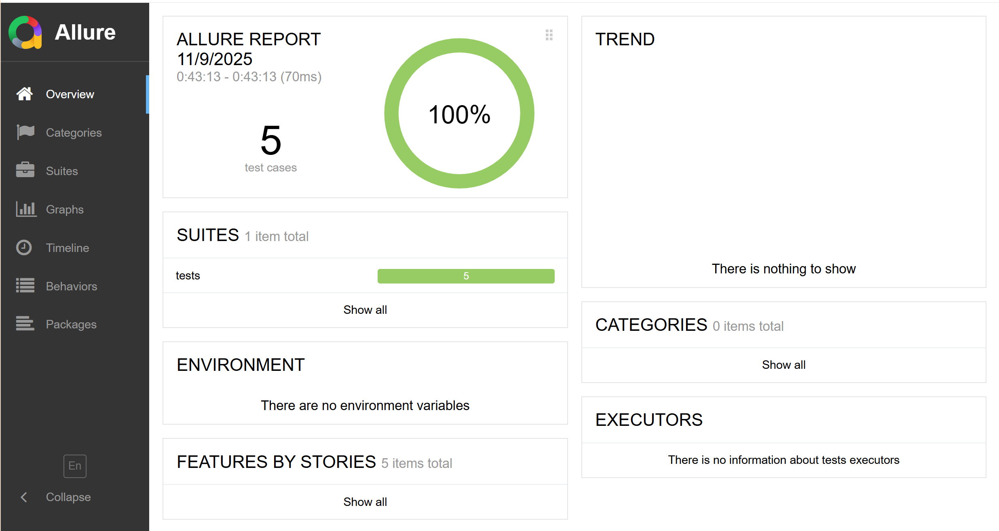

# API-autotests

## Инструкция по запуску автотестов и формированию Allure-отчёта

1. **Установите зависимости:**
   ```sh
   pip install -r requirements.txt
   ```

2. **Убедитесь, что API-сервис запущен и доступен по адресу http://localhost:8080**
   ([API-сервис](https://github.com/bondarenkokate73/simbirsoft_sdet_project))

4. **Запустите тесты параллельно с формированием Allure-отчёта:**
   ```sh
   pytest -n auto --alluredir=allure-results
   ```

5. **Сгенерируйте и откройе Allure-отчёт:**
   - Сгенерируйте HTML-отчёт:
     ```sh
     allure generate allure-results -o allure-report --clean
     ```
   - Откройте отчёт:
     ```sh
     allure open allure-report
     ```

6. **Allure-отчёт:**
   


## Тест-кейсы

### Test Case 1
**Идентификатор (ID):**  
TC_001

**Название (Title):**  
Создание новой сущности (Create Entity)

**Описание (Description):**  
Проверка возможности создания новой сущности через POST-запрос к API.

**Предусловия (Preconditions):**  
API-сервис запущен и доступен по адресу http://localhost:8080

**Шаги (Steps):**
1. Сформировать валидный payload для создания сущности.
2. Отправить POST-запрос на `/api/create` с этим payload.
3. Получить ответ с id созданной сущности.

**Ожидаемый результат (Expected Result):**  
В ответе возвращается id новой сущности. Ошибок не возникает.

**Фактический результат (Actual Result):**  
В ответе возвращается id новой сущности. Ошибок не возникает.

**Статус (Status):**  
Пройден

**Приоритет (Priority):**  
Высокий

---

### Test Case 2
**Идентификатор (ID):**  
TC_002

**Название (Title):**  
Получение сущности по id (Get Entity by ID)

**Описание (Description):**  
Проверка возможности получения ранее созданной сущности по её id.

**Предусловия (Preconditions):**  
- API-сервис запущен и доступен по адресу http://localhost:8080
- Сущность создана через API, известен её id.

**Шаги (Steps):**
1. Отправить GET-запрос на `/api/get/{id}`.
2. Получить ответ с данными сущности.

**Ожидаемый результат (Expected Result):**  
В ответе возвращаются корректные данные сущности, совпадающие с отправленными при создании.

**Фактический результат (Actual Result):**  
В ответе возвращаются корректные данные сущности, совпадающие с отправленными при создании.

**Статус (Status):**  
Пройден

**Приоритет (Priority):**  
Высокий

---

### Test Case 3
**Идентификатор (ID):**  
TC_003

**Название (Title):**  
Получение всех сущностей (Get All Entities)

**Описание (Description):**  
Проверка возможности получения списка всех сущностей.

**Предусловия (Preconditions):** 
- API-сервис запущен и доступен по адресу http://localhost:8080
- В системе есть хотя бы одна сущность.

**Шаги (Steps):**
1. Отправить POST-запрос на `/api/getAll`.
2. Получить ответ со списком сущностей.

**Ожидаемый результат (Expected Result):**  
В ответе возвращается список сущностей, структура валидна.

**Фактический результат (Actual Result):**  
В ответе возвращается список сущностей, структура валидна.

**Статус (Status):**  
Пройден

**Приоритет (Priority):**  
Средний

---

### Test Case 4
**Идентификатор (ID):**  
TC_004

**Название (Title):**  
Обновление сущности (Patch Entity)

**Описание (Description):**  
Проверка возможности обновления полей сущности через PATCH-запрос.

**Предусловия (Preconditions):**  
- API-сервис запущен и доступен по адресу http://localhost:8080
- Сущность создана через API, известен её id.

**Шаги (Steps):**
1. Получить текущие данные сущности по id.
2. Изменить необходимые поля в payload.
3. Отправить PATCH-запрос на `/api/patch/{id}` с обновлённым payload.
4. Получить сущность по id и проверить изменения.

**Ожидаемый результат (Expected Result):**  
Изменённые поля обновились, остальные остались прежними.

**Фактический результат (Actual Result):**  
Изменённые поля обновились, остальные остались прежними.

**Статус (Status):**  
Пройден

**Приоритет (Priority):**  
Высокий

---

### Test Case 5
**Идентификатор (ID):**  
TC_005

**Название (Title):**  
Удаление сущности (Delete Entity)

**Описание (Description):**  
Проверка возможности удаления сущности по id.

**Предусловия (Preconditions):**  
- API-сервис запущен и доступен по адресу http://localhost:8080
- Сущность создана через API, известен её id.

**Шаги (Steps):**
1. Отправить DELETE-запрос на `/api/delete/{id}`.
2. Попробовать получить сущность по id.

**Ожидаемый результат (Expected Result):**  
Сущность удалена, повторный запрос возвращает ошибку (400/404/500).

**Фактический результат (Actual Result):**  
Сущность удалена, повторный запрос возвращает ошибку (400/404/500).

**Статус (Status):**  
Пройден

**Приоритет (Priority):**  
Высокий

